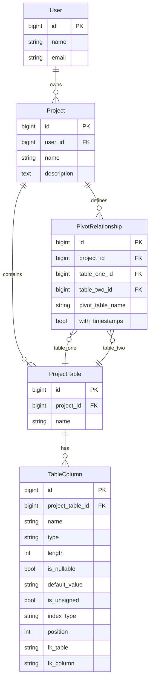

# Interactive Schema Visualizer (ISV) — Finalized Project Knowledge Base

> **Status**: Approved on 2026-05-13
> **Stack**: PHP 8.5 · Laravel 13.6.0 · Livewire 4 · MariaDB · Vite 8 · Tailwind CSS 4 · Mermaid.js

---

## Approved Decisions

| Question | Decision |
|---|---|
| Schema changes | **New migrations** to add columns (do not rewrite existing) |
| Authentication | **Install Laravel Breeze** (Blade-based auth scaffolding) |
| Model naming | **Keep `ProjectTable`** |
| Many-to-many support | **Yes** — pivot tables as a first-class concept in the visual designer |
| Multi-database | **No** — each Project is a single logical schema namespace |
| Mermaid rendering | **Client-side** (Mermaid.js via npm, rendered in the browser) |

---

## 1. Project Vision

A "Notion-like" workspace for database design with **Bidirectional Synchronization**:

- **Forward**: Building a database schema via a reactive UI updates the database models and generates a live Mermaid.js ER Diagram.
- **Reverse**: Manually editing the Mermaid.js DSL code parses the text and automatically syncs those changes back to the Eloquent models and database structure.

### Hierarchy

```
User → Project → ProjectTable → TableColumn
                → PivotRelationship (many-to-many)
```

---

## 2. Project Structure

```
app/
├── Actions/
│   ├── Schema/
│   │   ├── CreateTableAction.php
│   │   ├── UpdateTableAction.php
│   │   ├── DeleteTableAction.php
│   │   ├── CreateColumnAction.php
│   │   ├── UpdateColumnAction.php
│   │   ├── DeleteColumnAction.php
│   │   ├── ReorderColumnsAction.php
│   │   ├── CreatePivotRelationshipAction.php
│   │   ├── UpdatePivotRelationshipAction.php
│   │   └── DeletePivotRelationshipAction.php
│   └── Mermaid/
│       ├── GenerateMermaidAction.php
│       └── ParseMermaidAction.php
│
├── Contracts/
│   ├── MermaidGeneratorInterface.php
│   └── MermaidParserInterface.php
│
├── DTOs/
│   ├── ColumnDefinition.php
│   ├── TableDefinition.php
│   ├── PivotDefinition.php
│   └── SchemaDiff.php
│
├── Enums/
│   ├── ColumnType.php          # string, integer, bigInteger, text, boolean, etc.
│   └── IndexType.php           # none, primary, unique, index
│
├── Http/Controllers/
│   └── Controller.php
│
├── Livewire/
│   ├── Dashboard.php           # Project listing page
│   ├── SchemaDesigner.php      # Main workspace (orchestrator)
│   ├── TablePanel.php          # Left panel: table list + CRUD
│   ├── ColumnEditor.php        # Center panel: column editor for selected table
│   ├── PivotManager.php        # Many-to-many relationship manager
│   ├── MermaidPreview.php      # Right panel: live ER diagram
│   └── MermaidEditor.php       # Raw DSL code editor (reverse sync)
│
├── Livewire/Forms/
│   ├── TableForm.php
│   ├── ColumnForm.php
│   └── PivotForm.php
│
├── Models/
│   ├── User.php
│   ├── Project.php
│   ├── ProjectTable.php
│   ├── TableColumn.php
│   └── PivotRelationship.php   # Many-to-many definition between two ProjectTables
│
├── Policies/
│   └── ProjectPolicy.php
│
├── Providers/
│   └── AppServiceProvider.php
│
└── Services/
    └── SchemaSyncService.php   # Coordinates bidirectional sync pipeline

database/
├── factories/
│   ├── UserFactory.php
│   ├── ProjectFactory.php
│   ├── ProjectTableFactory.php
│   ├── TableColumnFactory.php
│   └── PivotRelationshipFactory.php
├── migrations/
│   ├── (existing 6 migrations)
│   ├── xxxx_enhance_table_columns_table.php
│   └── xxxx_create_pivot_relationships_table.php
└── seeders/
    └── DatabaseSeeder.php

resources/
├── css/app.css
├── js/app.js                   # Mermaid.js initialization
└── views/
    ├── components/layouts/
    │   └── app.blade.php       # Main layout
    ├── livewire/
    │   ├── dashboard.blade.php
    │   ├── schema-designer.blade.php
    │   ├── table-panel.blade.php
    │   ├── column-editor.blade.php
    │   ├── pivot-manager.blade.php
    │   ├── mermaid-preview.blade.php
    │   └── mermaid-editor.blade.php
    └── welcome.blade.php

routes/web.php

tests/
├── Feature/
│   ├── Actions/
│   │   ├── CreateTableActionTest.php
│   │   ├── CreateColumnActionTest.php
│   │   ├── CreatePivotRelationshipActionTest.php
│   │   ├── GenerateMermaidActionTest.php
│   │   └── ParseMermaidActionTest.php
│   ├── Livewire/
│   │   ├── DashboardTest.php
│   │   ├── TablePanelTest.php
│   │   ├── ColumnEditorTest.php
│   │   ├── PivotManagerTest.php
│   │   └── MermaidEditorTest.php
│   └── Services/
│       └── SchemaSyncServiceTest.php
└── Unit/
    ├── DTOs/
    │   ├── ColumnDefinitionTest.php
    │   └── PivotDefinitionTest.php
    └── Enums/
        └── ColumnTypeTest.php
```

---

## 3. Domain Model Design

### 3.1 Enhanced `table_columns` Schema (new migration)

| Column | Type | Notes |
|---|---|---|
| `is_nullable` | `boolean` | default: `false` |
| `default_value` | `varchar(255)` | nullable |
| `is_unsigned` | `boolean` | default: `false` |
| `length` | `integer` | nullable, e.g. `varchar(100)` |
| `position` | `smallint` | default: `0`, for drag-and-drop ordering |
| `index_type` | `varchar(20)` | nullable, backed by `IndexType` enum |
| `fk_table` | `varchar(255)` | nullable, referenced table name |
| `fk_column` | `varchar(255)` | nullable, referenced column name |

### 3.2 New `pivot_relationships` Table

| Column | Type | Notes |
|---|---|---|
| `id` | `bigint` | PK, auto-increment |
| `project_id` | `FK → projects.id` | cascade delete |
| `table_one_id` | `FK → project_tables.id` | first table in the M2M |
| `table_two_id` | `FK → project_tables.id` | second table in the M2M |
| `pivot_table_name` | `varchar(255)` | auto-generated or custom name |
| `with_timestamps` | `boolean` | default: `true` |
| `timestamps` | | |

### 3.3 Eloquent Relationships



---

## 4. Bidirectional Sync Architecture

### 4.1 Forward Pipeline (UI → DB → Mermaid)

```
User action (UI)
    │
    ▼
Livewire Component (TablePanel / ColumnEditor / PivotManager)
    │  calls
    ▼
Action Class (CreateTableAction / CreateColumnAction / CreatePivotRelationshipAction)
    │  validates + persists to DB
    ▼
Livewire Event dispatched: 'schema-updated'
    │
    ▼
MermaidPreview listens → calls GenerateMermaidAction
    │  queries all ProjectTables + TableColumns + PivotRelationships
    │  builds Mermaid ER DSL string including M2M relationship lines
    ▼
Client-side Mermaid.js re-renders the SVG diagram
```

### 4.2 Reverse Pipeline (Mermaid DSL → DB → UI)

```
User edits raw Mermaid DSL text (MermaidEditor component)
    │
    ▼
User clicks "Apply"
    │
    ▼
ParseMermaidAction
    │  parses DSL into TableDefinition[] + PivotDefinition[] arrays
    ▼
SchemaSyncService.diffAndApply()
    │  compares parsed schema vs. current DB state
    │  produces SchemaDiff DTO
    │  applies: create/update/delete tables, columns, and pivot relationships
    ▼
Livewire Event dispatched: 'schema-updated'
    │
    ▼
All UI panels re-render from DB state
```

### 4.3 Component Communication (Livewire Events)

| Event Name | Dispatched By | Listened By | Payload |
|---|---|---|---|
| `schema-updated` | Any Action (via component) | `MermaidPreview`, `TablePanel`, `ColumnEditor`, `PivotManager` | `projectId` |
| `table-selected` | `TablePanel` | `ColumnEditor` | `tableId` |
| `mermaid-applied` | `MermaidEditor` | `TablePanel`, `ColumnEditor`, `PivotManager`, `MermaidPreview` | `projectId` |

---

## 5. Technology Integration

### 5.1 Mermaid.js (Client-Side)

- Install: `npm install mermaid`
- Initialize in `app.js`, expose global render function
- `MermaidPreview` component uses `wire:ignore` + Alpine.js `$wire` integration
- Config: `theme: 'dark'`, `er: { useMaxWidth: true }`

### 5.2 Livewire 4

- Install: `composer require livewire/livewire`
- Class-based components (not Volt) for the workspace
- `#[On('schema-updated')]` attribute for event listeners
- Form Objects for validation (`TableForm`, `ColumnForm`, `PivotForm`)

### 5.3 Laravel Breeze

- Install: `composer require laravel/breeze --dev` → `php artisan breeze:install blade`
- Provides login/register/password-reset views
- Middleware: `auth` on all project routes

### 5.4 Layout

- Single Blade layout: `resources/views/components/layouts/app.blade.php`
- `@livewireStyles` / `@livewireScripts` / `@vite`
- Responsive 3-panel grid: Left (tables) | Center (columns) | Right (Mermaid)

---

## 6. Phased Execution Roadmap

### Phase 1: Foundation & Infrastructure 🏗️

**Goal**: Installable, testable base with enriched domain models.

| Step | Task | Verification |
|---|---|---|
| 1.1 | Install Livewire 4 | `php artisan livewire:info` succeeds |
| 1.2 | Install Mermaid.js | `npm run build` succeeds |
| 1.3 | Install Laravel Breeze (Blade) | Login/register pages render |
| 1.4 | Create app layout with Livewire + Vite | Browser shows styled page |
| 1.5 | Create migration: `enhance_table_columns_table` | `php artisan migrate` succeeds |
| 1.6 | Create migration: `create_pivot_relationships_table` | `php artisan migrate` succeeds |
| 1.7 | Create `ColumnType` and `IndexType` enums | Unit tests pass |
| 1.8 | Enrich all Models: `$fillable`, relationships, return types, casts | Pest tests pass |
| 1.9 | Create `PivotRelationship` model with relationships | Pest tests pass |
| 1.10 | Create Factories for all models | Factory creation works |
| 1.11 | Enable `Model::preventLazyLoading()` | N+1 throws in dev |
| 1.12 | Create DTOs: `ColumnDefinition`, `TableDefinition`, `PivotDefinition` | Unit tests pass |

**Gate**: `php artisan test` — all green.

---

### Phase 2: Forward Pipeline — UI to Database ⬇️

**Goal**: Working Livewire UI for full CRUD on tables, columns, and pivot relationships.

| Step | Task | Verification |
|---|---|---|
| 2.1 | Create `Dashboard` component (project list + create) | Browser: create project |
| 2.2 | Create `SchemaDesigner` full-page component (3-panel layout) | Route `/projects/{project}` renders |
| 2.3 | Create table Action classes + `TableForm` | Pest: tables persist to DB |
| 2.4 | Create `TablePanel` component | Browser: add/rename/delete tables |
| 2.5 | Create column Action classes + `ColumnForm` | Pest: columns persist to DB |
| 2.6 | Create `ColumnEditor` component | Browser: full column editing |
| 2.7 | Create pivot Action classes + `PivotForm` | Pest: pivots persist to DB |
| 2.8 | Create `PivotManager` component | Browser: create M2M relationships |
| 2.9 | Wire `table-selected` event | Click table → shows columns |
| 2.10 | Add `ProjectPolicy` + authorize routes | User A cannot access User B's project |

**Gate**: Full CRUD works. `php artisan test` — all green.

---

### Phase 3: Forward Pipeline — Database to Mermaid ➡️

**Goal**: Live ER diagram that auto-updates when schema changes.

| Step | Task | Verification |
|---|---|---|
| 3.1 | Create `GenerateMermaidAction` | Pest: known data → expected DSL |
| 3.2 | Include FK relationships as lines in DSL | FK columns produce arrows |
| 3.3 | Include M2M pivot relationships as lines in DSL | Pivot relationships produce `}o--o{` lines |
| 3.4 | Create `MermaidPreview` Livewire component | Browser: diagram appears |
| 3.5 | Wire `schema-updated` → `MermaidPreview` | UI change → diagram updates live |
| 3.6 | Dark theme styling | Visual inspection |

**Gate**: Forward sync complete. `php artisan test` — all green.

---

### Phase 4: Reverse Pipeline — Mermaid to Database ⬅️

**Goal**: Editing raw Mermaid DSL syncs changes back to database and UI.

| Step | Task | Verification |
|---|---|---|
| 4.1 | Build `ParseMermaidAction` (ER subset parser) | Pest: parse DSL → `TableDefinition[]` + `PivotDefinition[]` |
| 4.2 | Build `SchemaDiff` DTO | Unit test: diff detects changes |
| 4.3 | Build `SchemaSyncService.diffAndApply()` | Feature test: DSL changes → DB updated |
| 4.4 | Create `MermaidEditor` component (textarea + CodeMirror) | Browser: edit DSL text |
| 4.5 | Wire "Apply" → parse → sync → `schema-updated` | Edit DSL → all panels update |
| 4.6 | Inline parse error display | Invalid DSL shows error |

**Gate**: Bidirectional sync complete. `php artisan test` — all green.

---

### Phase 5: Polish & DX 💎

**Goal**: Production-quality UX and developer experience.

| Step | Task | Verification |
|---|---|---|
| 5.1 | Column drag-and-drop reordering | Drag → `position` updates |
| 5.2 | Undo support (command history) | Click undo → reverts |
| 5.3 | Export Mermaid DSL as `.mmd` file | Download works |
| 5.4 | Export schema as Laravel migration PHP | Valid migration generated |
| 5.5 | UI polish: loading states, transitions, empty states | Visual review |
| 5.6 | Demo seed in `DatabaseSeeder` | `migrate:fresh --seed` shows data |
| 5.7 | Responsive design pass | Mobile layout works |

**Gate**: ISV is feature-complete. Full test suite green.

---

## 7. Key Architectural Decisions

| Decision | Choice | Rationale |
|---|---|---|
| Component style | Class-based Livewire | Complex state in the designer needs explicit class structure |
| Business logic | Action classes | Single-purpose, testable, reusable |
| Mermaid rendering | Client-side (browser) | Real-time reactivity, no server roundtrip |
| Mermaid parsing | Custom PHP parser (server) | Only ER subset needed; keeps logic in Laravel |
| Validation | Livewire Form Objects | Clean separation, reusable for create/edit |
| State sync | Livewire events (`$dispatch`) | Native inter-component communication |
| Enums | PHP 8.5 backed enums | Type safety for `ColumnType`, `IndexType` |
| DTOs | `readonly` PHP 8.5 classes | Immutable data transfer between layers |
| CSS | Tailwind CSS 4 | Already installed, great Livewire DX |
| Auth | Laravel Breeze (Blade) | Simple, convention-based, matches stack |
| M2M relationships | First-class `PivotRelationship` model | Explicit entity enables clean CRUD and Mermaid generation |

---

## 8. Incremental Gate Rule

> **No phase begins until the previous phase's tests are 100% green and browser verification passes.**
