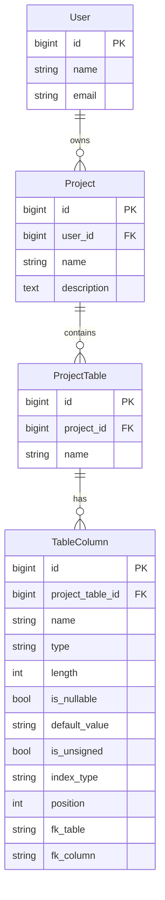

# Interactive Schema Visualizer (ISV) — Architectural Proposal & Roadmap

## 1. Current State Audit

| Aspect | Status |
|---|---|
| **Stack** | PHP 8.5, Laravel 13.6.0, MariaDB (via XAMPP), Vite 8, Tailwind CSS 4 |
| **Existing Models** | `User`, `Project`, `ProjectTable`, `TableColumn` — all empty shells (no relationships, no casts, no `$fillable`) |
| **Existing Migrations** | Hierarchy is already in place: `users → projects → project_tables → table_columns` with `cascadeOnDelete` FKs |
| **Frontend** | No Livewire installed. No components. Default `welcome.blade.php` only |
| **Tests** | Default Pest stubs only |
| **Missing Packages** | `livewire/livewire` (v4), `livewire/volt` (optional), no Mermaid integration yet |

> [!IMPORTANT]
> The database engine reported is **MariaDB** (via XAMPP), not MySQL. MariaDB is fully compatible for our use case, but we should note this in the knowledge base. All `Schema::` and migration features we need work identically on both.

---

## 2. User Review Required

> [!WARNING]
> **Schema Reset Decision**: The current `table_columns` migration is minimal (only `name`, `type`, `is_primary`). The ISV vision requires significantly richer column metadata (nullable, default value, unsigned, length, index type, FK references). This means we need **new migrations to add these columns**. Since the project has no production data, an alternative is to **re-write the existing migrations** from scratch. Which approach do you prefer?

> [!IMPORTANT]
> **Authentication**: The hierarchy requires `User → Project` ownership. Should we install **Laravel Breeze** (simple, Blade-based auth scaffolding) for login/register, or do you want to defer authentication and hardcode a single user for now to focus on the core ISV features first?

> [!IMPORTANT]
> **Naming Convention**: The current model is `ProjectTable` (avoiding collision with the reserved word "Table"). An alternative is `SchemaTable` or `Entity`. Recommendation: **Keep `ProjectTable`** — it's clear and avoids ambiguity. Please confirm or suggest an alternative.

---

## 3. Open Questions

1. **Multi-database support**: Should a single Project be able to connect to different database schemas, or is each Project always a logical design within one schema namespace?
2. **Relationship types**: Beyond foreign keys on columns, do you want to support **many-to-many (pivot tables)** as a first-class concept in the visual designer, or are explicit FK columns sufficient for Phase 1?
3. **Mermaid rendering**: Should the ER diagram render **client-side** (Mermaid.js via CDN/npm, rendered in the browser) or **server-side** (generating SVG on the backend)? Recommendation: **Client-side** for real-time reactivity.

---

## 4. Proposed Project Structure

```
app/
├── Actions/                          # Single-purpose business logic classes
│   ├── Schema/
│   │   ├── CreateTableAction.php       # Create a ProjectTable + auto-add 'id' PK column
│   │   ├── UpdateTableAction.php       # Rename table
│   │   ├── DeleteTableAction.php       # Delete table + cascade
│   │   ├── CreateColumnAction.php      # Add column to a ProjectTable
│   │   ├── UpdateColumnAction.php      # Modify column properties
│   │   ├── DeleteColumnAction.php      # Remove column
│   │   └── ReorderColumnsAction.php    # Change column display order
│   └── Mermaid/
│       ├── GenerateMermaidAction.php    # Forward: Models → Mermaid DSL string
│       └── ParseMermaidAction.php      # Reverse: Mermaid DSL string → diffable schema array
│
├── Contracts/                          # Interfaces for testability
│   ├── MermaidGeneratorInterface.php
│   └── MermaidParserInterface.php
│
├── DTOs/                               # Data Transfer Objects (PHP 8.5 readonly classes)
│   ├── ColumnDefinition.php            # Immutable value object for column metadata
│   ├── TableDefinition.php             # Immutable value object for table + columns
│   └── SchemaDiff.php                  # Represents the diff between two schema states
│
├── Http/
│   └── Controllers/
│       └── Controller.php              # (existing, base)
│
├── Livewire/                           # Livewire 4 Components
│   ├── Dashboard.php                   # Project listing page
│   ├── SchemaDesigner.php              # Main workspace (orchestrator component)
│   ├── TablePanel.php                  # Left panel: table list + CRUD
│   ├── ColumnEditor.php                # Center panel: column list for selected table
│   ├── MermaidPreview.php              # Right panel: live ER diagram
│   └── MermaidEditor.php              # Code editor for raw Mermaid DSL (reverse sync)
│
├── Livewire/Forms/                     # Livewire Form Objects
│   ├── TableForm.php                   # Validation for table create/edit
│   └── ColumnForm.php                  # Validation for column create/edit
│
├── Models/                             # Eloquent Models
│   ├── User.php                        # (existing, to be enriched)
│   ├── Project.php                     # (existing, to be enriched)
│   ├── ProjectTable.php                # (existing, to be enriched)
│   └── TableColumn.php                 # (existing, to be enriched)
│
├── Providers/
│   └── AppServiceProvider.php          # Bind contracts, preventLazyLoading()
│
├── Enums/                              # PHP 8.5 Backed Enums
│   ├── ColumnType.php                  # string, integer, bigInteger, text, boolean, etc.
│   └── IndexType.php                   # none, primary, unique, index
│
├── Services/                           # Orchestration services
│   └── SchemaSyncService.php           # Coordinates the bidirectional sync pipeline
│
database/
├── factories/
│   ├── UserFactory.php                 # (existing)
│   ├── ProjectFactory.php              # [NEW]
│   ├── ProjectTableFactory.php         # [NEW]
│   └── TableColumnFactory.php          # [NEW]
├── migrations/
│   ├── (existing migrations)
│   └── xxxx_enhance_table_columns_table.php  # [NEW] Add nullable, default, unsigned, length, position, index_type, fk_*
├── seeders/
│   └── DatabaseSeeder.php             # Demo project with sample tables
│
resources/
├── css/
│   └── app.css                         # (existing, Tailwind entry)
├── js/
│   └── app.js                          # (existing, + Mermaid.js init)
├── views/
│   ├── components/
│   │   └── layouts/
│   │       └── app.blade.php           # [NEW] Main layout with @livewireStyles / @livewireScripts
│   ├── livewire/                       # Livewire component views (auto-resolved)
│   │   ├── dashboard.blade.php
│   │   ├── schema-designer.blade.php
│   │   ├── table-panel.blade.php
│   │   ├── column-editor.blade.php
│   │   ├── mermaid-preview.blade.php
│   │   └── mermaid-editor.blade.php
│   └── welcome.blade.php              # (existing)
│
routes/
├── web.php                             # Livewire full-page component routes
│
tests/
├── Feature/
│   ├── Actions/
│   │   ├── CreateTableActionTest.php
│   │   ├── CreateColumnActionTest.php
│   │   ├── GenerateMermaidActionTest.php
│   │   └── ParseMermaidActionTest.php
│   ├── Livewire/
│   │   ├── DashboardTest.php
│   │   ├── TablePanelTest.php
│   │   ├── ColumnEditorTest.php
│   │   └── MermaidEditorTest.php
│   └── Services/
│       └── SchemaSyncServiceTest.php
├── Unit/
│   ├── DTOs/
│   │   └── ColumnDefinitionTest.php
│   └── Enums/
│       └── ColumnTypeTest.php
```

---

## 5. Domain Model Design

### 5.1 Enhanced `table_columns` Schema

The current migration only has `name`, `type`, `is_primary`. We need to extend it:

```
table_columns
├── id                  (bigint, PK, auto-increment)
├── project_table_id    (FK → project_tables.id, cascade delete)
├── name                (varchar 255)
├── type                (varchar 50)        ← backed by ColumnType enum
├── length              (int, nullable)     ← e.g., varchar(100)
├── is_nullable         (boolean, default: false)
├── default_value       (varchar 255, nullable)
├── is_unsigned         (boolean, default: false)
├── index_type          (varchar 20, nullable)  ← backed by IndexType enum (primary, unique, index, null)
├── position            (smallint, default: 0)  ← for drag-and-drop ordering
├── fk_table            (varchar 255, nullable) ← referenced table name (for FK relationships)
├── fk_column           (varchar 255, nullable) ← referenced column name
├── timestamps
```

### 5.2 Eloquent Relationships



---

## 6. Bidirectional Sync Architecture

This is the **core innovation** of ISV. The sync engine is a pipeline with two directions:

### 6.1 Forward Pipeline (UI → DB → Mermaid)

```
User action (UI)
    │
    ▼
Livewire Component (e.g., ColumnEditor)
    │  calls
    ▼
Action Class (e.g., CreateColumnAction)
    │  validates + persists to DB
    ▼
Livewire Event dispatched: 'schema-updated'
    │
    ▼
MermaidPreview component listens → calls GenerateMermaidAction
    │  queries all ProjectTables + TableColumns for this Project
    │  builds Mermaid ER DSL string
    ▼
Client-side Mermaid.js re-renders the SVG diagram
```

**Key principle**: Every UI mutation goes through an Action class. The Action persists to the database. After persistence, a Livewire event (`schema-updated`) triggers the Mermaid re-generation.

### 6.2 Reverse Pipeline (Mermaid DSL → DB → UI)

```
User edits raw Mermaid DSL text (MermaidEditor component)
    │
    ▼
User clicks "Apply" (or debounced auto-sync)
    │
    ▼
ParseMermaidAction
    │  parses the DSL into a TableDefinition[] array
    ▼
SchemaSyncService.diffAndApply()
    │  compares parsed schema vs. current DB state
    │  produces a SchemaDiff DTO
    │  applies changes: create/update/delete tables and columns
    ▼
Livewire Event dispatched: 'schema-updated'
    │
    ▼
All UI panels (TablePanel, ColumnEditor) re-render from DB
```

> [!NOTE]
> The **Mermaid parser** is the most complex piece. Mermaid ER DSL has a well-defined syntax:
> ```
> erDiagram
>     TABLE_NAME {
>         type columnName PK "comment"
>     }
>     TABLE_A ||--o{ TABLE_B : "relationship_label"
> ```
> We will build a PHP regex/state-machine parser for this subset. We do **not** need to parse the full Mermaid grammar — only the ER diagram subset.

### 6.3 Component Communication (Livewire Events)

| Event Name | Dispatched By | Listened By | Payload |
|---|---|---|---|
| `schema-updated` | Any Action (via component) | `MermaidPreview`, `TablePanel`, `ColumnEditor` | `projectId` |
| `table-selected` | `TablePanel` | `ColumnEditor` | `tableId` |
| `mermaid-applied` | `MermaidEditor` | `TablePanel`, `ColumnEditor`, `MermaidPreview` | `projectId` |

---

## 7. Technology Integration Details

### 7.1 Mermaid.js (Client-Side)

- Install via npm: `npm install mermaid`
- Initialize in `app.js` and expose a global render function
- The `MermaidPreview` Livewire component passes the DSL string to the JS renderer via `wire:ignore` + Alpine.js `$wire` integration
- Mermaid config: `theme: 'dark'`, `er: { useMaxWidth: true }`

### 7.2 Livewire 4 Installation

```shell
composer require livewire/livewire
```

- Use **class-based components** (not Volt) for the main workspace — they're better for complex state management
- Use Livewire's `#[On('schema-updated')]` attribute for event listeners
- Use Form Objects (`TableForm`, `ColumnForm`) for validation

### 7.3 Layout

- Single Blade layout: `resources/views/components/layouts/app.blade.php`
- Uses `@livewireStyles` / `@livewireScripts` / `@vite`
- Responsive grid: Left panel (tables) | Center (columns) | Right (Mermaid diagram)

---

## 8. Phased Execution Roadmap

### Phase 1: Foundation & Infrastructure 🏗️
**Goal**: Installable, testable base with enriched domain models.

| Step | Task | Verification |
|---|---|---|
| 1.1 | Install Livewire 4 (`composer require livewire/livewire`) | `php artisan livewire:info` succeeds |
| 1.2 | Install Mermaid.js (`npm install mermaid`) | `npm run build` succeeds |
| 1.3 | Create the app layout (`layouts/app.blade.php`) with Livewire + Vite | Browser shows styled empty page |
| 1.4 | Create migration: `enhance_table_columns_table` (add `is_nullable`, `default_value`, `is_unsigned`, `length`, `position`, `index_type`, `fk_table`, `fk_column`) | `php artisan migrate` succeeds |
| 1.5 | Enrich all 4 Models: `$fillable`, relationships, return types, casts, `ColumnType` + `IndexType` enums | Pest unit tests pass for relationships |
| 1.6 | Create Factories for `Project`, `ProjectTable`, `TableColumn` | `ProjectTable::factory()->create()` works |
| 1.7 | Enable `Model::preventLazyLoading()` in `AppServiceProvider` | N+1 queries throw in dev |
| 1.8 | Create `ColumnDefinition` and `TableDefinition` DTOs | Unit tests pass |

**Milestone**: `php artisan test` — all green. Models are production-quality with proper relationships, casts, and factories.

---

### Phase 2: Forward Pipeline — UI to Database ⬇️
**Goal**: A working Livewire UI that can create/edit/delete tables and columns, persisting to the database.

| Step | Task | Verification |
|---|---|---|
| 2.1 | Create `Dashboard` Livewire component (project list + create) | Browser test: create a project, see it listed |
| 2.2 | Create `SchemaDesigner` — full-page component, 3-panel layout | Route `/projects/{project}` renders the workspace |
| 2.3 | Create Action classes: `CreateTableAction`, `UpdateTableAction`, `DeleteTableAction` | Pest feature tests: tables persist to DB |
| 2.4 | Create `TablePanel` Livewire component (list tables, add/rename/delete) | Browser: add "users" table, see it in list |
| 2.5 | Create Action classes: `CreateColumnAction`, `UpdateColumnAction`, `DeleteColumnAction` | Pest feature tests: columns persist to DB |
| 2.6 | Create `ColumnEditor` Livewire component (column form with all fields) | Browser: add columns with type, nullable, default, etc. |
| 2.7 | Wire `table-selected` event between `TablePanel` → `ColumnEditor` | Clicking table shows its columns |
| 2.8 | Create `TableForm` and `ColumnForm` Livewire Form Objects | Validation errors display correctly |

**Milestone**: Full CRUD on tables and columns via UI. Database reflects all changes. No diagram yet.

---

### Phase 3: Forward Pipeline — Database to Mermaid ➡️
**Goal**: Live ER diagram that auto-updates when schema changes.

| Step | Task | Verification |
|---|---|---|
| 3.1 | Create `GenerateMermaidAction` — queries Project's tables/columns, outputs Mermaid ER DSL string | Pest test: given known data, DSL matches expected output |
| 3.2 | Create `MermaidPreview` Livewire component — renders Mermaid DSL via client-side JS | Browser: diagram appears |
| 3.3 | Wire `schema-updated` event → `MermaidPreview` re-renders | Add a column in UI → diagram updates in real-time |
| 3.4 | Style the diagram: dark theme, proper entity styling | Visual inspection |
| 3.5 | Handle FK relationships in the diagram (draw lines between entities) | FK columns show relationship arrows |

**Milestone**: **Forward sync is complete.** UI changes → DB → live Mermaid diagram. This is a fully functional v1.

---

### Phase 4: Reverse Pipeline — Mermaid to Database ⬅️
**Goal**: Editing raw Mermaid DSL text syncs changes back to the database and UI.

| Step | Task | Verification |
|---|---|---|
| 4.1 | Build `ParseMermaidAction` — regex/state-machine parser for ER diagram subset | Pest unit tests: parse known DSL → `TableDefinition[]` |
| 4.2 | Build `SchemaDiff` DTO — compares two `TableDefinition[]` arrays | Unit test: diff detects added/removed/renamed tables and columns |
| 4.3 | Build `SchemaSyncService.diffAndApply()` — applies `SchemaDiff` to the database | Feature test: modify DSL → DB reflects changes |
| 4.4 | Create `MermaidEditor` Livewire component — textarea with syntax highlighting (via a JS code editor library, e.g., CodeMirror) | Browser: edit DSL text |
| 4.5 | Wire "Apply" button → `ParseMermaidAction` → `SchemaSyncService` → `schema-updated` event | Edit DSL → click Apply → all panels update |
| 4.6 | Add error handling: display parse errors inline below the editor | Invalid DSL shows red error message |

**Milestone**: **Bidirectional sync is complete.** The core innovation is working end-to-end.

---

### Phase 5: Polish, Auth & DX 💎
**Goal**: Production-quality UX, authentication, and developer experience.

| Step | Task | Verification |
|---|---|---|
| 5.1 | Install Breeze or implement basic auth (login/register) | Protected routes require auth |
| 5.2 | Add authorization: `ProjectPolicy` (users can only access their own projects) | Pest test: user A cannot access user B's project |
| 5.3 | Column drag-and-drop reordering (using `position` field + JS sortable library) | Drag columns → `position` updates in DB |
| 5.4 | "Undo" support — implement a simple command history on the `SchemaSyncService` | Click undo → last change is reverted |
| 5.5 | Export: Download Mermaid DSL as `.mmd` file | Button works |
| 5.6 | Export: Download schema as Laravel migration PHP code | Button generates valid migration |
| 5.7 | UI polish: loading states, transitions, empty states, responsive design | Visual review |
| 5.8 | Seed a demo project in `DatabaseSeeder` for development | `php artisan migrate:fresh --seed` shows demo data |

**Milestone**: ISV is feature-complete and polished.

---

## 9. Verification Plan

### Automated Tests (per phase)

```shell
# Run after every phase
php artisan test

# Run specific test suites
php artisan test --filter=Actions
php artisan test --filter=Livewire
php artisan test --filter=Unit
```

### Browser Verification (per phase)

After each phase, we will use the browser tool to:
1. Navigate to the application URL
2. Perform the key user flows for that phase
3. Capture screenshots as visual proof
4. Record a browser session video for complex interactions

### Incremental Gate Rule

> [!CAUTION]
> **No phase begins until the previous phase's tests are 100% green and the browser verification passes.** This is non-negotiable — it ensures we never build on a broken foundation.

---

## 10. Key Architectural Decisions Summary

| Decision | Choice | Rationale |
|---|---|---|
| **Component style** | Class-based Livewire (not Volt) | Complex state management in the designer workspace benefits from explicit class structure |
| **Business logic** | Action classes | Single-purpose, testable, reusable. Per Laravel best practices skill |
| **Mermaid rendering** | Client-side (Mermaid.js in browser) | Real-time reactivity without server roundtrip for rendering |
| **Mermaid parsing** | Custom PHP parser (server-side) | We only need the ER subset; no need for a full JS grammar parser |
| **Validation** | Livewire Form Objects | Clean separation from components, reusable for create/edit |
| **State sync** | Livewire events (`$dispatch`) | Native Livewire inter-component communication |
| **Enums** | PHP 8.5 backed enums | Type safety for `ColumnType` and `IndexType` |
| **DTOs** | `readonly` PHP 8.5 classes | Immutable data transfer between layers |
| **CSS** | Tailwind CSS 4 (already installed) | Already in the project, good DX with Livewire |
