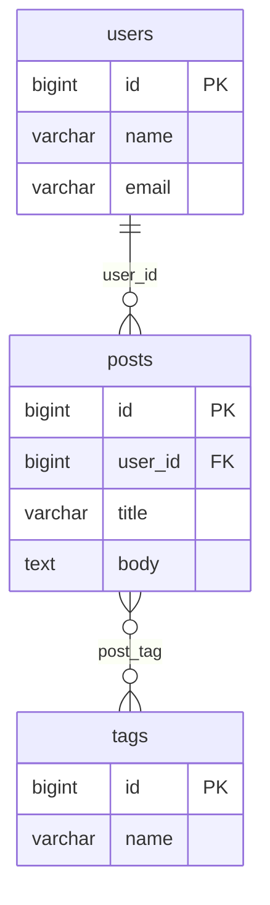

# Phase 3: Forward Pipeline — Database to Mermaid ➡️

**Goal (two steps)**:
1. **Step A** (active): On-demand ERD — user clicks "View DB as ERD" button to generate the diagram
2. **Step B** (built + tested, then **commented out** for a future ISV update): Live auto-update via `schema-updated` event

**Prerequisites**: Phase 2 complete — 146 tests all green. All CRUD components, actions, forms, and policies are in place.

---

## Proposed Changes

### GenerateMermaidAction (Steps 3.1–3.3)

#### [NEW] [GenerateMermaidAction.php](file:///c:/Users/bolas/Herd/test-models/app/Actions/Mermaid/GenerateMermaidAction.php)

Single-purpose action class that takes a `Project` and generates a Mermaid ER DSL string.

**Logic:**
1. Eager-load `$project->tables.columns` and `$project->pivotRelationships.tableOne/tableTwo`
2. Build the `erDiagram` header
3. For each `ProjectTable`:
   - Emit an entity block: `TableName { ... }` with each column as `type name "key/constraints"`
   - Column attributes map: `ColumnType` → Mermaid type label, `is_primary` → `PK`, FK columns → `FK`
4. **FK relationship lines** (Step 3.2): For any column with `fk_table` + `fk_column` set, emit:
   - `ReferencedTable ||--o{ CurrentTable : "fk_column_name"` (one-to-many by convention)
5. **M2M pivot relationship lines** (Step 3.3): For each `PivotRelationship`, emit:
   - `TableOne }o--o{ TableTwo : "pivot_table_name"` (many-to-many)

**Mermaid type mapping** (`ColumnType` → DSL label):
```
bigInteger → bigint, boolean → bool, date → date, dateTime → datetime,
decimal → decimal, float → float, integer → int, json → json,
smallInteger → smallint, string → varchar, text → text,
timestamp → timestamp, unsignedBigInteger → ubigint
```

**Example output:**


---

### MermaidPreview Component (Steps 3.4–3.5)

#### [NEW] [MermaidPreview.php](file:///c:/Users/bolas/Herd/test-models/app/Livewire/MermaidPreview.php)

Class-based Livewire component. **Two-step behavior:**

**Step A (on-demand):**
- Receives `$project` as a public property
- Public `string $mermaidDsl = ''` property (initially empty — no diagram shown)
- `generateDiagram()` action method — called when user clicks "View DB as ERD" button. Calls `GenerateMermaidAction` and sets `$mermaidDsl`
- No auto-rendering on mount — user must click the button

**Step B (implemented → tested → commented out):**
- Add `#[On('schema-updated')]` attribute to `generateDiagram()` — verify it works with a passing test
- Then comment out the `#[On('schema-updated')]` line with a `// TODO: Uncomment for live auto-update in next ISV release` note
- The test for this behavior will use `->todo()` so it's preserved but skipped in CI

#### [NEW] [mermaid-preview.blade.php](file:///c:/Users/bolas/Herd/test-models/resources/views/livewire/mermaid-preview.blade.php)

Uses `wire:ignore` on the Mermaid container so Livewire doesn't diff the rendered SVG. Alpine.js component handles:
1. Watching `$wire.mermaidDsl` for changes
2. Calling `mermaid.render()` API to produce SVG
3. Inserting SVG into the container element

```html
<div>
    <div class="p-4 border-b border-gray-200 flex items-center justify-between">
        <h3 class="font-semibold text-gray-200">ER Diagram</h3>
        <button wire:click="generateDiagram" class="...">
            View DB as ERD
        </button>
    </div>
    <div
        x-data="mermaidPreview"
        x-effect="renderDiagram()"
        class="p-4 overflow-auto"
    >
        <div wire:ignore x-ref="mermaidContainer" id="mermaid-preview-container"></div>
        {{-- Empty state before button is clicked --}}
        <template x-if="!hasDiagram">
            <p class="text-gray-400 text-sm text-center py-8">
                Click "View DB as ERD" to generate the diagram
            </p>
        </template>
    </div>
</div>
```

The Alpine component `mermaidPreview` will:
- Watch `$wire.mermaidDsl` — when it changes (after button click or auto-update), render the SVG
- Call `mermaid.render('mermaid-svg-...', dsl)` to get SVG
- Insert SVG into `$refs.mermaidContainer`

---

### Mermaid.js Initialization (Step 3.4)

#### [MODIFY] [app.js](file:///c:/Users/bolas/Herd/test-models/resources/js/app.js)

Add Mermaid.js initialization with dark theme config and expose a global `renderMermaidDiagram()` function for Alpine:

```js
import './bootstrap';
import mermaid from 'mermaid';

mermaid.initialize({
    startOnLoad: false,
    theme: 'dark',
    er: { useMaxWidth: true },
    securityLevel: 'loose',
    fontFamily: 'Figtree, sans-serif',
});

window.mermaidInstance = mermaid;
```

Register Alpine component in app.js (since Alpine is bundled with Livewire 4, we register via `document.addEventListener('alpine:init', ...)`:

```js
document.addEventListener('alpine:init', () => {
    Alpine.data('mermaidPreview', () => ({
        hasDiagram: false,
        async renderDiagram() {
            const dsl = this.$wire.mermaidDsl;
            const container = this.$refs.mermaidContainer;
            if (!dsl || !container) {
                this.hasDiagram = false;
                return;
            }
            try {
                const { svg } = await window.mermaidInstance.render(
                    'mermaid-svg-' + Date.now(), dsl
                );
                container.innerHTML = svg;
                this.hasDiagram = true;
            } catch (e) {
                container.innerHTML = '<p class="text-red-400 text-sm">Diagram render error</p>';
                this.hasDiagram = false;
            }
        }
    }));
});
```

---

### Schema Designer Layout Update

#### [MODIFY] [schema-designer.blade.php](file:///c:/Users/bolas/Herd/test-models/resources/views/livewire/schema-designer.blade.php)

Change the 3-panel grid from `lg:grid-cols-12` with Pivot Manager in the right panel, to a **4-panel** layout:
- Left: `TablePanel` (col-span-2)
- Center: `ColumnEditor` (col-span-4)
- Center-right: `PivotManager` (col-span-3)
- Right: `MermaidPreview` (col-span-3)

```html
<div class="h-[calc(100vh-8rem)] grid grid-cols-1 lg:grid-cols-12 gap-0">
    {{-- Left Panel: Tables --}}
    <div class="lg:col-span-2 border-r border-gray-200 bg-white overflow-y-auto" id="panel-tables">
        <livewire:table-panel :project="$project" />
    </div>

    {{-- Center Panel: Column Editor --}}
    <div class="lg:col-span-4 bg-gray-50 overflow-y-auto" id="panel-columns">
        <livewire:column-editor :project="$project" />
    </div>

    {{-- Center-right Panel: Pivot Manager --}}
    <div class="lg:col-span-3 border-l border-gray-200 bg-white overflow-y-auto" id="panel-pivots">
        <livewire:pivot-manager :project="$project" />
    </div>

    {{-- Right Panel: Mermaid Preview --}}
    <div class="lg:col-span-3 border-l border-gray-200 bg-gray-900 overflow-y-auto" id="panel-mermaid">
        <livewire:mermaid-preview :project="$project" />
    </div>
</div>
```

> [!IMPORTANT]
> The right panel uses `bg-gray-900` to match the Mermaid dark theme, creating clear visual separation.

---

### Dark Theme Styling (Step 3.6)

The Mermaid panel uses `bg-gray-900` with dark text. Mermaid.js is initialized with `theme: 'dark'`. The panel header uses light text (`text-gray-200`) on the dark background. SVG diagram renders natively with Mermaid's dark theme colors.

No additional CSS is needed — Mermaid's built-in dark theme handles ER diagram node and edge colors.

---

### Tests

#### [NEW] [GenerateMermaidActionTest.php](file:///c:/Users/bolas/Herd/test-models/tests/Feature/Actions/GenerateMermaidActionTest.php)

Pest feature tests:
- `it generates empty erDiagram for project with no tables`
- `it generates entity block for a single table with columns`
- `it maps column types to correct Mermaid type labels`
- `it marks primary key columns with PK`
- `it marks foreign key columns with FK`
- `it generates FK relationship lines for columns with fk_table`
- `it generates M2M relationship lines for pivot relationships`
- `it generates complete DSL with tables, FKs, and pivots`
- `it returns empty string for project with no tables`

#### [NEW] [MermaidPreviewTest.php](file:///c:/Users/bolas/Herd/test-models/tests/Feature/Livewire/MermaidPreviewTest.php)

Livewire component tests:
- `it renders for authenticated project owner`
- `it starts with empty mermaidDsl (no diagram on load)`
- `it generates diagram on generateDiagram call`
- `it re-renders on schema-updated event` *(Step B only)*
- `it shows empty state before button is clicked`

---

## Verification Plan

### Automated Tests

```bash
php artisan test --compact tests/Feature/Actions/GenerateMermaidActionTest.php
php artisan test --compact tests/Feature/Livewire/MermaidPreviewTest.php
php artisan test --compact  # Full suite to ensure no regressions
```

### Manual Verification

- `npm run build` succeeds with Mermaid.js bundled
- Browser: Navigate to a project → see the Mermaid preview panel with dark background
- Add a table → diagram updates live
- Add columns with FK references → relationship arrows appear
- Add pivot relationships → M2M lines appear
